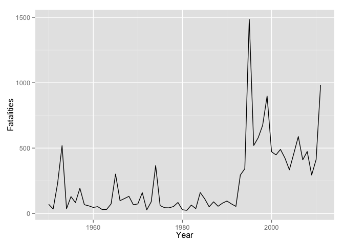
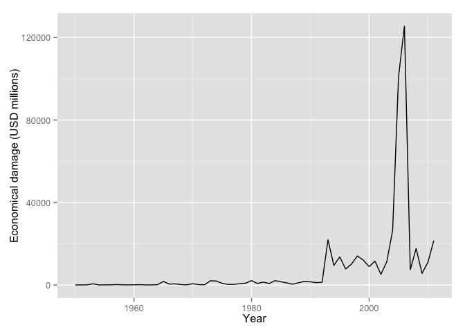

# The most harmful weather events accross United States 

# Synopsis

In this report we will indicate the most harmful weather
events accross Unites States.

This information will be useful in order to concentrate
the efforts to mitigate and prevent damages caused by 
these severe events.

# Data Processing

Loading dependency libraries:


```r
library(ggplot2)
```

```
## Warning: package 'ggplot2' was built under R version 3.1.3
```

Sets locale:


```r
Sys.setlocale("LC_ALL", "en_US")
```

```
## [1] "en_US/en_US/en_US/C/en_US/pt_BR.UTF-8"
```

Downloading and loading the data:


```r
storm_data_url <- 
    "https://d396qusza40orc.cloudfront.net/repdata%2Fdata%2FStormData.csv.bz2"
download.file(storm_data_url, destfile = "stormdata.csv.bz2", method = "curl")
storm_data <- read.csv(bzfile("stormdata.csv.bz2"))
```

Sample data:


```r
str(storm_data)
```

```
## 'data.frame':	902297 obs. of  37 variables:
##  $ STATE__   : num  1 1 1 1 1 1 1 1 1 1 ...
##  $ BGN_DATE  : Factor w/ 16335 levels "1/1/1966 0:00:00",..: 6523 6523 4242 11116 2224 2224 2260 383 3980 3980 ...
##  $ BGN_TIME  : Factor w/ 3608 levels "00:00:00 AM",..: 272 287 2705 1683 2584 3186 242 1683 3186 3186 ...
##  $ TIME_ZONE : Factor w/ 22 levels "ADT","AKS","AST",..: 7 7 7 7 7 7 7 7 7 7 ...
##  $ COUNTY    : num  97 3 57 89 43 77 9 123 125 57 ...
##  $ COUNTYNAME: Factor w/ 29601 levels "","5NM E OF MACKINAC BRIDGE TO PRESQUE ISLE LT MI",..: 13513 1873 4598 10592 4372 10094 1973 23873 24418 4598 ...
##  $ STATE     : Factor w/ 72 levels "AK","AL","AM",..: 2 2 2 2 2 2 2 2 2 2 ...
##  $ EVTYPE    : Factor w/ 985 levels "   HIGH SURF ADVISORY",..: 834 834 834 834 834 834 834 834 834 834 ...
##  $ BGN_RANGE : num  0 0 0 0 0 0 0 0 0 0 ...
##  $ BGN_AZI   : Factor w/ 35 levels "","  N"," NW",..: 1 1 1 1 1 1 1 1 1 1 ...
##  $ BGN_LOCATI: Factor w/ 54429 levels ""," Christiansburg",..: 1 1 1 1 1 1 1 1 1 1 ...
##  $ END_DATE  : Factor w/ 6663 levels "","1/1/1993 0:00:00",..: 1 1 1 1 1 1 1 1 1 1 ...
##  $ END_TIME  : Factor w/ 3647 levels ""," 0900CST",..: 1 1 1 1 1 1 1 1 1 1 ...
##  $ COUNTY_END: num  0 0 0 0 0 0 0 0 0 0 ...
##  $ COUNTYENDN: logi  NA NA NA NA NA NA ...
##  $ END_RANGE : num  0 0 0 0 0 0 0 0 0 0 ...
##  $ END_AZI   : Factor w/ 24 levels "","E","ENE","ESE",..: 1 1 1 1 1 1 1 1 1 1 ...
##  $ END_LOCATI: Factor w/ 34506 levels ""," CANTON"," TULIA",..: 1 1 1 1 1 1 1 1 1 1 ...
##  $ LENGTH    : num  14 2 0.1 0 0 1.5 1.5 0 3.3 2.3 ...
##  $ WIDTH     : num  100 150 123 100 150 177 33 33 100 100 ...
##  $ F         : int  3 2 2 2 2 2 2 1 3 3 ...
##  $ MAG       : num  0 0 0 0 0 0 0 0 0 0 ...
##  $ FATALITIES: num  0 0 0 0 0 0 0 0 1 0 ...
##  $ INJURIES  : num  15 0 2 2 2 6 1 0 14 0 ...
##  $ PROPDMG   : num  25 2.5 25 2.5 2.5 2.5 2.5 2.5 25 25 ...
##  $ PROPDMGEXP: Factor w/ 19 levels "","-","?","+",..: 17 17 17 17 17 17 17 17 17 17 ...
##  $ CROPDMG   : num  0 0 0 0 0 0 0 0 0 0 ...
##  $ CROPDMGEXP: Factor w/ 9 levels "","?","0","2",..: 1 1 1 1 1 1 1 1 1 1 ...
##  $ WFO       : Factor w/ 542 levels ""," CI","%SD",..: 1 1 1 1 1 1 1 1 1 1 ...
##  $ STATEOFFIC: Factor w/ 250 levels "","ALABAMA, Central",..: 1 1 1 1 1 1 1 1 1 1 ...
##  $ ZONENAMES : Factor w/ 25112 levels "","                                                                                                                               "| __truncated__,..: 1 1 1 1 1 1 1 1 1 1 ...
##  $ LATITUDE  : num  3040 3042 3340 3458 3412 ...
##  $ LONGITUDE : num  8812 8755 8742 8626 8642 ...
##  $ LATITUDE_E: num  3051 0 0 0 0 ...
##  $ LONGITUDE_: num  8806 0 0 0 0 ...
##  $ REMARKS   : Factor w/ 436781 levels "","\t","\t\t",..: 1 1 1 1 1 1 1 1 1 1 ...
##  $ REFNUM    : num  1 2 3 4 5 6 7 8 9 10 ...
```

Considering only (valid) states of United States:


```r
us_states_and_dc <- 
c("DC", "AL","MT","AK","NE","AZ","NV","AR","NH","CA","NJ","CO","NM","CT","NY",
"DE","NC","FL","ND","GA","OH","HI","OK","ID","OR","IL","PA","IN","RI",
"IA","SC","KS","SD","KY","TN","LA","TX","ME","UT","MD","VT","MA","VA",
"MI","WA","MN","WV","MS","WI","MO","WY")

us_states_and_dc
```

```
##  [1] "DC" "AL" "MT" "AK" "NE" "AZ" "NV" "AR" "NH" "CA" "NJ" "CO" "NM" "CT"
## [15] "NY" "DE" "NC" "FL" "ND" "GA" "OH" "HI" "OK" "ID" "OR" "IL" "PA" "IN"
## [29] "RI" "IA" "SC" "KS" "SD" "KY" "TN" "LA" "TX" "ME" "UT" "MD" "VT" "MA"
## [43] "VA" "MI" "WA" "MN" "WV" "MS" "WI" "MO" "WY"
```

```r
storm_data <- storm_data[storm_data$STATE %in% us_states_and_dc,]
```

Converting dates columns:


```r
storm_data$BGN_DATE <- as.Date(storm_data$BGN_DATE, "%m/%d/%Y")
storm_data$END_DATE <- as.Date(storm_data$END_DATE, "%m/%d/%Y")
storm_data$YEAR <- as.integer(format(storm_data$BGN_DATE, "%Y"))
```

Normalizing Property damage:


```r
storm_data$PROPDMG[storm_data$PROPDMGEXP == "K"] <-
    (storm_data$PROPDMG[storm_data$PROPDMGEXP == "K"] * 1000)
storm_data$PROPDMGEXP[storm_data$PROPDMGEXP == "K"] <- ""

storm_data$PROPDMG[storm_data$PROPDMGEXP == "k"] <-
    (storm_data$PROPDMG[storm_data$PROPDMGEXP == "k"] * 1000)
storm_data$PROPDMGEXP[storm_data$PROPDMGEXP == "k"] <- ""

storm_data$PROPDMG[storm_data$PROPDMGEXP == "M"] <-
    (storm_data$PROPDMG[storm_data$PROPDMGEXP == "M"] * 1000 * 1000)
storm_data$PROPDMGEXP[storm_data$PROPDMGEXP == "M"] <- ""

storm_data$PROPDMG[storm_data$PROPDMGEXP == "m"] <-
    (storm_data$PROPDMG[storm_data$PROPDMGEXP == "m"] * 1000 * 1000)
storm_data$PROPDMGEXP[storm_data$PROPDMGEXP == "m"] <- ""

storm_data$PROPDMG[storm_data$PROPDMGEXP == "B"] <-
    (storm_data$PROPDMG[storm_data$PROPDMGEXP == "B"] * 1000 * 1000 * 1000)
storm_data$PROPDMGEXP[storm_data$PROPDMGEXP == "B"] <- ""

storm_data$PROPDMG[storm_data$PROPDMGEXP == "b"] <-
    (storm_data$PROPDMG[storm_data$PROPDMGEXP == "b"] * 1000 * 1000 * 1000)
storm_data$PROPDMGEXP[storm_data$PROPDMGEXP == "b"] <- ""

for(exp in as.character(1:10)) {
    storm_data$PROPDMG[storm_data$PROPDMGEXP == exp] <-
        (storm_data$PROPDMG[storm_data$PROPDMGEXP == exp] * (10 ^ as.integer(exp)))
    storm_data$PROPDMGEXP[storm_data$PROPDMGEXP == exp] <- ""
}
```

Normalizing Crop damage:


```r
storm_data$CROPDMG[storm_data$CROPDMGEXP == "K"] <-
    (storm_data$CROPDMG[storm_data$CROPDMGEXP == "K"] * 1000)
storm_data$CROPDMGEXP[storm_data$CROPDMGEXP == "K"] <- ""

storm_data$CROPDMG[storm_data$CROPDMGEXP == "k"] <-
    (storm_data$CROPDMG[storm_data$CROPDMGEXP == "k"] * 1000)
storm_data$CROPDMGEXP[storm_data$CROPDMGEXP == "k"] <- ""

storm_data$CROPDMG[storm_data$CROPDMGEXP == "M"] <-
    (storm_data$CROPDMG[storm_data$CROPDMGEXP == "M"] * 1000 * 1000)
storm_data$CROPDMGEXP[storm_data$CROPDMGEXP == "M"] <- ""

storm_data$CROPDMG[storm_data$CROPDMGEXP == "m"] <-
    (storm_data$CROPDMG[storm_data$CROPDMGEXP == "m"] * 1000 * 1000)
storm_data$CROPDMGEXP[storm_data$CROPDMGEXP == "m"] <- ""

storm_data$CROPDMG[storm_data$CROPDMGEXP == "B"] <-
    (storm_data$CROPDMG[storm_data$CROPDMGEXP == "B"] * 1000 * 1000 * 1000)
storm_data$CROPDMGEXP[storm_data$CROPDMGEXP == "B"] <- ""

storm_data$CROPDMG[storm_data$CROPDMGEXP == "b"] <-
    (storm_data$CROPDMG[storm_data$CROPDMGEXP == "b"] * 1000 * 1000 * 1000)
storm_data$CROPDMGEXP[storm_data$CROPDMGEXP == "b"] <- ""

for(exp in as.character(1:10)) {
    storm_data$CROPDMG[storm_data$CROPDMGEXP == exp] <-
        (storm_data$CROPDMG[storm_data$CROPDMGEXP == exp] * (10 ^ as.integer(exp)))
    storm_data$CROPDMGEXP[storm_data$CROPDMGEXP == exp] <- ""
}
```

Considering the data with valid property and crop manage:


```r
storm_data <- storm_data[storm_data$PROPDMGEXP == "",]
storm_data <- storm_data[storm_data$CROPDMGEXP == "",]
```

Computing population harm per state and event type:


```r
pop_harm_per_evtype <- aggregate(
    storm_data[c("FATALITIES", "INJURIES")],
    by=storm_data[c("STATE", "EVTYPE")],
    FUN=sum)

pop_harm_per_evtype <-
    pop_harm_per_evtype [
        (pop_harm_per_evtype$FATALITIES +
        pop_harm_per_evtype$INJURIES)  > 0
    ,]

pop_harm_per_evtype <- pop_harm_per_evtype[
    order(
        pop_harm_per_evtype$STATE,
        -pop_harm_per_evtype$FATALITIES,
        -pop_harm_per_evtype$INJURIES
    ),
]
```

Filtering the most population harmful event per state:


```r
pop_harm_per_evtype$temp <- (
    pop_harm_per_evtype$FATALITIES * 1000000 + 
    pop_harm_per_evtype$INJURIES
)

pop_harm_top_type_per_state <- aggregate(
    temp ~ STATE, pop_harm_per_evtype, max
)

pop_harm_top_type_per_state <- merge (
    pop_harm_top_type_per_state, pop_harm_per_evtype)

pop_harm_top_type_per_state <- pop_harm_top_type_per_state[,
    names(pop_harm_top_type_per_state) != "temp"
]
```

Computing populational (fatalities) damage per year:


```r
pop_harm_per_year <- aggregate(
    storm_data["FATALITIES"],
    by=storm_data["YEAR"],
    FUN=sum)
```

Computing economical (property and crop) damage per state and event type:


```r
storm_data$ECODMG <- (storm_data$PROPDMG + storm_data$CROPDMG)

eco_harm_per_evtype <- aggregate(
    storm_data["ECODMG"],
    by=storm_data[c("STATE", "EVTYPE")],
    FUN=sum)

eco_harm_per_evtype <-
    eco_harm_per_evtype [        
        eco_harm_per_evtype$ECODMG  > 0
    ,]

eco_harm_per_evtype <- eco_harm_per_evtype[
    order(
        eco_harm_per_evtype$STATE,
        -eco_harm_per_evtype$ECODMG
    ),
]
```

Filtering the most economical harmful event per state:


```r
eco_harm_top_type_per_state <- aggregate(
    ECODMG ~ STATE, eco_harm_per_evtype, max
)

eco_harm_top_type_per_state <- merge (
    eco_harm_top_type_per_state, eco_harm_per_evtype)
```

Computing economical (property and crop) damage per year:


```r
storm_data$ECODMGINM <- (storm_data$ECODMG / (1000000))

eco_harm_per_year <- aggregate(
    storm_data["ECODMGINM"],
    by=storm_data["YEAR"],
    FUN=sum)
```

# Results

POPULATIONAL damage per year:


```r
qplot(
    YEAR,
    FATALITIES,
    data = pop_harm_per_year,
    xlab = "Year",
    ylab = "Fatalities",
    geom=c("line"))
```

 

The most harmful events per state in terms of POPULATIONAL impacts are:


```r
pop_harm_top_type_per_state
```

```
##    STATE         EVTYPE FATALITIES INJURIES
## 1     AK      AVALANCHE         33       17
## 2     AL        TORNADO        617     7929
## 3     AR        TORNADO        379     5116
## 4     AZ    FLASH FLOOD         62      150
## 5     CA EXCESSIVE HEAT        110      260
## 6     CO      LIGHTNING         48      260
## 7     CT      HIGH WIND          6       11
## 8     DC EXCESSIVE HEAT         20      316
## 9     DE EXCESSIVE HEAT          7       51
## 10    FL    RIP CURRENT        172      149
## 11    GA        TORNADO        180     3926
## 12    HI      HIGH SURF         21       18
## 13    IA        TORNADO         81     2208
## 14    ID      AVALANCHE         16        9
## 15    IL           HEAT        653      241
## 16    IN        TORNADO        252     4224
## 17    KS        TORNADO        236     2721
## 18    KY        TORNADO        125     2806
## 19    LA        TORNADO        153     2637
## 20    MA        TORNADO        105     1734
## 21    MD EXCESSIVE HEAT         88      461
## 22    ME      LIGHTNING          6       70
## 23    MI        TORNADO        243     3362
## 24    MN        TORNADO         99     1976
## 25    MO        TORNADO        388     4330
## 26    MS        TORNADO        450     6244
## 27    MT      LIGHTNING          9       30
## 28    NC        TORNADO        126     2536
## 29    ND        TORNADO         25      326
## 30    NE        TORNADO         54     1158
## 31    NH      TSTM WIND          6       30
## 32    NJ EXCESSIVE HEAT         39      300
## 33    NM    FLASH FLOOD         16       18
## 34    NV           HEAT         54        0
## 35    NY EXCESSIVE HEAT         93        1
## 36    OH        TORNADO        191     4438
## 37    OK        TORNADO        296     4829
## 38    OR      HIGH WIND         17       50
## 39    PA EXCESSIVE HEAT        359      320
## 40    RI      HIGH SURF          2        0
## 41    RI           HEAT          2        0
## 42    SC        TORNADO         59     1314
## 43    SD        TORNADO         18      452
## 44    TN        TORNADO        368     4748
## 45    TX        TORNADO        538     8207
## 46    UT      AVALANCHE         44       25
## 47    VA        TORNADO         36      914
## 48    VT          FLOOD          4        5
## 49    WA      AVALANCHE         35       36
## 50    WI        TORNADO         96     1601
## 51    WV    FLASH FLOOD         24       10
## 52    WY      AVALANCHE         23       21
```

ECONOMICAL damage per year:


```r
qplot(
    YEAR,
    ECODMGINM,
    data = eco_harm_per_year,
    xlab = "Year",
    ylab = "Economical damage (USD millions)",
    geom=c("line"))
```

 

The most harmful events per state in terms of ECONOMICAL impacts are:


```r
eco_harm_top_type_per_state
```

```
##    STATE       ECODMG            EVTYPE
## 1     AK    157139940             FLOOD
## 2     AL   6378094060           TORNADO
## 3     AR   2591514320           TORNADO
## 4     AZ   2829059700              HAIL
## 5     CA 117377795000             FLOOD
## 6     CO   1543434750              HAIL
## 7     CT    596236620           TORNADO
## 8     DC    127600000    TROPICAL STORM
## 9     DE     40150000     COASTAL FLOOD
## 10    FL  28552065000 HURRICANE/TYPHOON
## 11    GA   3271812170           TORNADO
## 12    HI    157093000       FLASH FLOOD
## 13    IA   2970229000             FLOOD
## 14    ID    114217000             FLOOD
## 15    IL  10034400000       RIVER FLOOD
## 16    IN   2595309890           TORNADO
## 17    KS   2682165670           TORNADO
## 18    KY    890676680           TORNADO
## 19    LA  31742735000       STORM SURGE
## 20    MA    756039120           TORNADO
## 21    MD    539195000    TROPICAL STORM
## 22    ME    318230000         ICE STORM
## 23    MI   1073278550           TORNADO
## 24    MN   1916897190           TORNADO
## 25    MO   4822897720           TORNADO
## 26    MS  15007715800 HURRICANE/TYPHOON
## 27    MT    129074700              HAIL
## 28    NC   6404991000         HURRICANE
## 29    ND   3989802000             FLOOD
## 30    NE   1745710460           TORNADO
## 31    NH     64934000         ICE STORM
## 32    NJ   2111650000             FLOOD
## 33    NM   1509700000  WILD/FOREST FIRE
## 34    NV    683945000             FLOOD
## 35    NY   1835148500       FLASH FLOOD
## 36    OH   2285241290           TORNADO
## 37    OK   3269264780           TORNADO
## 38    OR    741032500             FLOOD
## 39    PA   1796167400           TORNADO
## 40    RI     92860000             FLOOD
## 41    SC    536771240           TORNADO
## 42    SD    231852880           TORNADO
## 43    TN   4249543300             FLOOD
## 44    TX   6722465000           DROUGHT
## 45    UT    331875000             FLOOD
## 46    VA    526620000 HURRICANE/TYPHOON
## 47    VT   1112434000             FLOOD
## 48    WA    219904500              HAIL
## 49    WI   1187846860       FLASH FLOOD
## 50    WV    486476100       FLASH FLOOD
## 51    WY    113102900              HAIL
```


